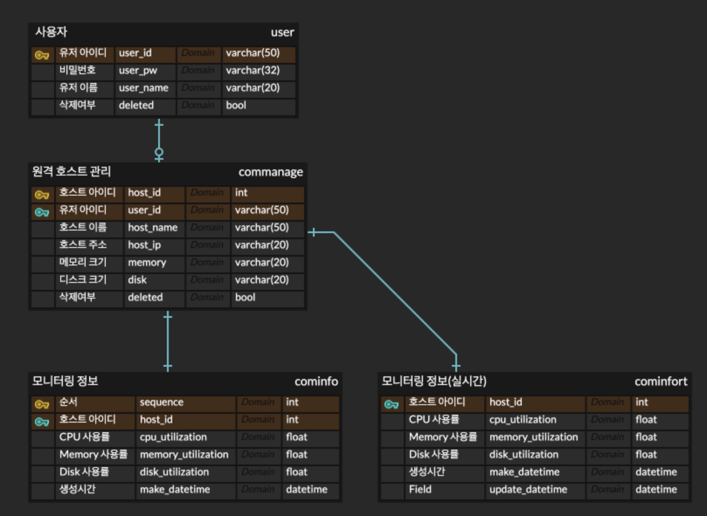
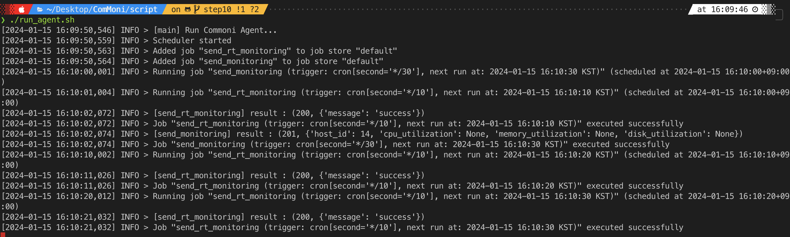

# ComMoni

서버에서 수집한 실시간 데이터를 이용하여 모니터링을 할 수 있는 기능을 제공합니다.

## 모니터링으로 수집할 데이터

* CPU 사용률
* 메모리 사용률
* 디스크 사용률

## DB 구조

## 프로젝트 구조

### Server

* app
    * api
        * auth : 로그인 관련
        * cominfo : 모니터링 관련
        * commanage : 모니터링 대상 관리
        * exception : api 예외
        * user : 사용자 관련
    * common : 공통 코드
    * configs : 설정 관련
    * db_init : orm 디비 초기화 관련
    * tests : 테스트
    * database.py : 뎅터베이스 설정
    * main.py : 파이썬 메인

### Agent

* app
    * auth : 로그인 관련
    * common : 공통 코드
    * configs : 설정 관련
    * req_data : http 요청 데이터 포맷 관련
    * schedule : 스케줄러 관련
    * sig : 시그널 처리
    * tests : 테스트
    * main.py : 파이썬 메인

---

# screenshot

* agent 실행 화면
  

* 실시간 모니터링 데이터
  

* 모니터링 데이터
  